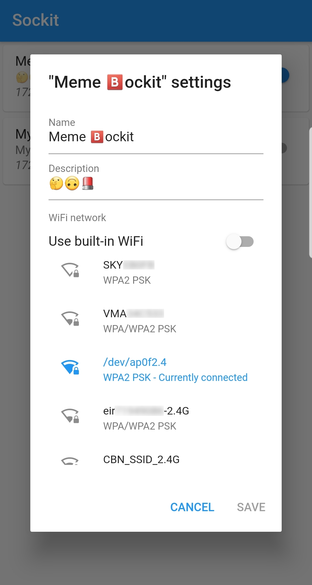

# Sockit
Sockit provides a Lua-based firmware (using [NodeMCU](https://nodemcu.readthedocs.io/en/master/))
and a simple [Flutter](https://flutter.dev)-based app for controlling a smart socket which is powered by an
[ESP8266](https://en.wikipedia.org/wiki/ESP8266) microcontroller.

<p align="center">
  
  
</p>

# Getting started
To get started with Sockit, you'll need a compatible smart plug / switch. Sockit was built with the
[Sonoff S20](https://www.itead.cc/smart-socket.html) in mind, but really any ESP8266-powered device should
work, but the pin definitons in [`lua/pins.lua`](lua/pins.lua) will need to be edited (and then the firmware
must be re-built).

## Flashing the firmware
You can grab the latest pre-built firmware (for the Sonoff S20) from the [releases page](../../releases).
Before flashing, you'll need to connect your device to your computer via a UART adapter (**3.3V logic or
your ESP8266 will be fried!**). [This page](https://esphome.io/devices/sonoff_s20.html#step-2-connecting-uart)
does a good job explaining how to open up a Sonoff S20 and connect up a UART adapter.

Once connected, you'll need [esptool](https://github.com/espressif/esptool), or some other ESP8266 flashing
tool. Then you can run the following command:

```bash
esptool write_flash --erase-all --flash-mode dout 0 /path/to/sockit-esp8266.bin
```

Note:
 - `esptool` may need to be run as root
 - It might be necessary to specify the serial port with `-p`
 - `--flash-mode` will depend on your ESP8266, but for Sonoffs this is generally `DOUT`

## App installation
You can get a pre-built version of the app from the Play Store - it costs €1.99 (or your regional equivalent).
The Play Store version is built directly from this code (and no binaries are provided in this repo). Think of
buying the app from the store as a "donation"!

If you want to build the app yourself, that's as easy as installing
[Flutter](https://flutter.dev/docs/get-started/install) and running `flutter build` in the `app/` directory.

### iOS?
In theory, since the app was written with Flutter (with no Android-specific parts), it should work without
any changes on iOS (aside from adding graphics / metadata to the stub native app). However, since I don't own
a Mac or iOS device (and don't have the $99 developer license from Apple), this is currently not a priority.

Feel free to try and build the app on your own iOS device!

## Usage
### Initial configuration
Once everything is flashed / installed, you can plug in your device. After a few seconds, the status LED
(green on a Sonoff S20) will go solid. You should then search for (and connect to) a WiFi network named
"Sockit-<something>". This is a special network hosted by the device which allows you to control the device
without connecting it your local network.

You can the open the app, and after a quick search (swipe down to refresh), the device should be found by
some Multicast magic. From here, you can tap the device in the list to switch the socket on / off. Although
the Sockit can be used permanently in this way, it will be open to anybody who can see the network and range
will be quite limited.

### Changing settings
In order to open the settings menu, long press on the device in the list. From here, you can set the name,
description and, most importantly, WiFi settings for your device. By sliding the "Use built-in WiFi" switch
to the off position, you can scroll through the list of networks that the device is able to connect to.
Tapping on one of these will then prompt you for a password.

Once the WiFi settings are saved (and you decided to connect your device to an existing WiFi network), the
status LED will blink continuously until a connection is established (this will also happen if the connection
is lost). The LED will then switch off.

### Button actions
The built-in button on the Sonoff S20 has a number of programmed functions:
- Pressing the button once will switch the electrical socket on or off.
- Holding it for more than a second will temporarily switch the device into using built-in WiFi (instead of
trying to connect to a configured network - **useful if the password was entered incorrectly and the device
is stuck trying to connect**)
- Holding for more than 5 seconds will reboot the device
- Holding for more than 20 seconds will erase configuration and reboot ("factory reset")

### CLI
A simple command-line tool is provided in the `tools/` directory, run `tools/cli.py --help` for more
information.

# App development
To simplify app development, a simple emulator for the network protocol used by the Lua firmware is provided
in Python. (see the `tools/` directory).

# Firmware development
## Building the firmware
If you want to build the firmware from source (e.g. if you want to change the pin definitions for use with a
device other than the Sonoff S20), follow these instructions.

1. Clone this repo and run `git submodule update --init --recursive` - this will download the NodeMCU code
2. Install [SRecord](http://srecord.sourceforge.net/) - necessary for producing the final one-binary firmware
3. Run `scripts/apply_firmware_config.sh` to apply build-time configuration (this should only be done once)
4. Run `scripts/build.sh` to build the firmware

Once built, a flashable firmware will be available at `firmware/bin/sockit-esp8266.bin`

## Making changes
If you're making changes to the firmware (either Lua code or build configuration, it's possible that the LFS
addresses (defined in [`scripts/lfs_info.sh`](scripts/lfs_info.sh)) will change. In order to calculate these
values, build the firmware without embedding the LFS image by running `scripts/build.sh no_lfs`. After flashing
this firmware, follow the instructions from
[here](https://github.com/nodemcu/nodemcu-firmware/blob/master/lua_examples/lfs/lfs_fragments.lua) to obtain
updated values for the variables in `scripts/lfs_info.sh`.

## Faster development
If you're making lots of changes to the Lua code, it can be annoying to have to re-build, erase and flash the
whole firmware each time. Instead of doing this, you can flash the full firmware once and run
`scripts/lfs_flash.sh` each time you make a change. This will recompile the LFS image and flash it over the
correct area on the chip in one go. You might want to tweak the `esptool` command in this script based on your
setup.
